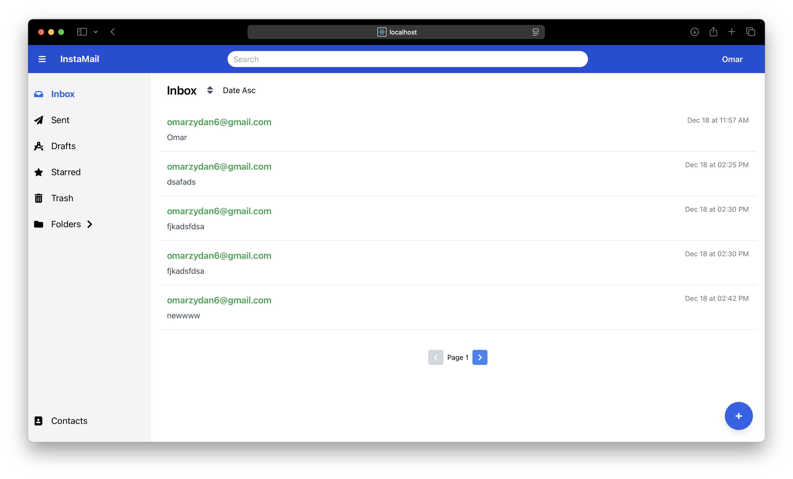
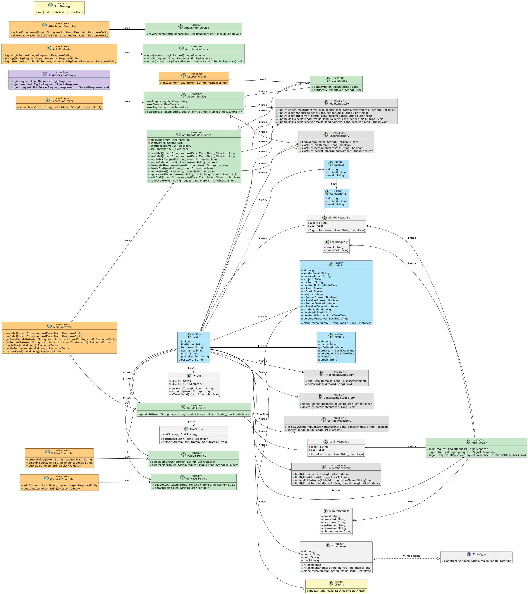
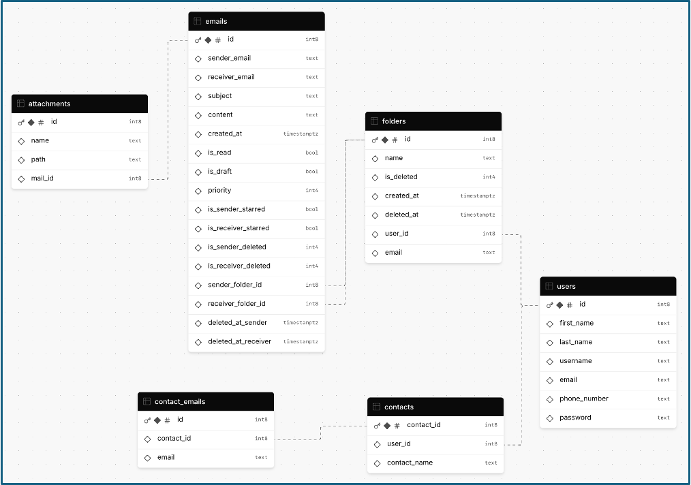

# InstaMail

InstaMail is a web-based email application designed to offer a modern, user-friendly platform for managing email communications. It combines advanced functionalities, intuitive design, and robust security features, making it ideal for efficient and secure email handling.

This is Our Fourth Assignment in Design Patterns Course (CSED27 Alexandria University)

## `🌟`Project Objectives

* Enhance Usability: Provide a clean, user-friendly interface for managing emails.
* Streamline Communication: Enable multi-recipient support and contact management.
* Simplify Organization: Offer folder management, advanced sorting, and filtering.
* Enable Real-Time Updates: Use SSE for instant email notifications.
* Strengthen Security: Implement JWT authentication and BCrypt encryption.
* Apply Design Patterns: Ensure scalability and efficiency with proven patterns.
* Support Scalability: Handle growing user demands with a robust architecture.
* Promote Learning: Demonstrate real-world applications of engineering principles.

## `🔧`Technologies Used

- **Frontend**: React
- **Backend**: Spring Boot
- **Database**: MySQL
- **Authentication**: JWT & BCrypt
- **Real-Time Communication**: SSE (Server-Sent Events)

## Design Patterns Used

1. **Singleton Pattern**: Ensures a single instance of core application services like database connections.
2. **Proxy Pattern**: Limits login attempts to enhance security and prevent brute force attacks.
3. **Strategy Pattern**: Allows dynamic email sorting by different criteria.
4. **Filter Pattern**: Enables filtering emails by categories like Inbox, Sent, and Trash.
5. **Prototype Pattern**: Efficiently handles emails sent to multiple recipients by cloning email objects.

## `🚀`System Features

- **Email Management**: Compose, send, receive, and organize emails into customizable folders.
- **Real-Time Notifications**: Stay updated with new emails using Server-Sent Events (SSE).
- **Advanced Search & Filters**: Locate and sort emails by categories, keywords, or folders.
- **Contact Management**: Save recipient details for quicker email composition.
- **Email Attachments**: Attach files to emails with ease.
- **Security**: Secure authentication using JWT and hashed passwords with BCrypt.
- **Sorting**: Dynamically sort emails by date, sender, or subject.

## UML and Database Design

### **UML Diagram:** 

### DataBase Design:

## Project Report

### For more detalied information check [Project Report](https://github.com/omarzydan610/InstaMail/blob/main/assets/InstaMail.pdf)
